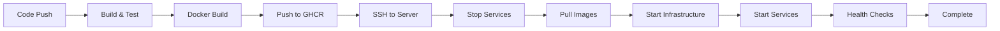

# .NET Microservices CI/CD Project

## 🚀 **Project Overview**

Complete CI/CD solution cho .NET 9.0 microservices architecture với:
- **AuthenticationService**: JWT authentication + Swagger UI
- **EmailService**: Email processing với Kafka messaging  
- **GatewayAPI**: YARP reverse proxy + API routing
- **Infrastructure**: SQL Server 2022, Kafka KRaft mode, Docker networking

## 📋 **Tech Stack**

- **.NET 9.0**: Latest framework cho performance tối ưu
- **Docker**: Containerization với multi-stage builds
- **GitHub Actions**: CI/CD automation
- **GitHub Container Registry**: Docker image storage
- **SQL Server 2022**: Database với Entity Framework Core
- **Apache Kafka**: Event streaming (KRaft mode - no Zookeeper)
- **YARP**: Reverse proxy cho API Gateway
- **Swagger/OpenAPI**: API documentation
- **DigitalOcean**: Production hosting

## 🏗️ **Architecture Diagram**

```
┌─────────────────────────────────────────────────────────────┐
│                    External Traffic                         │
└─────────────────────┬───────────────────────────────────────┘
                      │
              ┌───────▼───────┐
              │ Gateway API   │ :5000
              │ (YARP Proxy)  │
              └───────┬───────┘
                      │
        ┌─────────────┼─────────────┐
        │             │             │
┌───────▼───────┐     │     ┌───────▼───────┐
│ Auth Service  │     │     │ Email Service │
│ :5001         │     │     │ :5002         │
│ + Swagger UI  │     │     │               │
└───────┬───────┘     │     └───────┬───────┘
        │             │             │
        │    ┌────────▼────────┐    │
        │    │ microservices-  │    │
        │    │    network      │    │
        │    └────────┬────────┘    │
        │             │             │
        │   ┌─────────▼─────────┐   │
        └───► SQL Server 2022  ◄───┘
            │ :1433             │
            └─────────┬─────────┘
                      │
            ┌─────────▼─────────┐
            │ Kafka KRaft      │
            │ :9092            │
            │ Topic: user-     │
            │ registered       │
            └──────────────────┘
```

## 🔧 **Setup & Deployment**

### **1. Prerequisites**
```bash
# Local Development
- .NET 9.0 SDK
- Docker Desktop
- Git

# Production Server (DigitalOcean)
- Ubuntu 22.04
- Docker installed
- SSH access
```

### **2. GitHub Repository Setup**

1. **Clone repository**:
   ```bash
   git clone <repository-url>
   cd dotnet_cicd
   ```

2. **Configure GitHub Secrets**:
   ```
   DIGITALOCEAN_HOST=159.223.68.114
   DIGITALOCEAN_USERNAME=root  
   DIGITALOCEAN_PASSWORD=your-password
   ```

3. **Container Registry**:
   - GitHub Container Registry (GHCR) tự động enabled
   - Images: `ghcr.io/[owner]/[service]:latest`

### **3. Local Development**

```bash
# Build services
dotnet restore
dotnet build

# Run with Docker Compose (optional)
docker-compose up -d

# Access services
- Gateway: http://localhost:5000/health
- Auth: http://localhost:5001/health
- Auth Swagger: http://localhost:5001/swagger
- Email: http://localhost:5002/health
```

### **4. Production Deployment**

#### **Automatic Deployment**
```bash
# Push to main branch triggers CI/CD
git push origin main

# Or merge Pull Request
```

#### **Manual Deployment**
```bash
# Via GitHub Actions UI
- Go to Actions tab
- Select "Manual Deployment" 
- Choose environment: production/staging
- Run workflow
```

#### **Quick Fix Deployment**
```bash
# Apply fixes to current deployment
expect scripts/update-current-deployment.exp
```

## 📊 **CI/CD Pipeline Flow**



## 🌐 **Production URLs**

- **Gateway API**: http://159.223.68.114:5000
- **Auth Service**: http://159.223.68.114:5001  
- **Auth Swagger UI**: http://159.223.68.114:5001/swagger
- **Email Service**: http://159.223.68.114:5002

## 📁 **Project Structure**

```
dotnet_cicd/
├── AuthenticationService/          # JWT Auth + Swagger
│   ├── Controllers/
│   ├── Models/
│   ├── Program.cs
│   └── Dockerfile
├── EmailService/                   # Kafka Email Processing
│   ├── Controllers/
│   ├── Services/
│   ├── Program.cs
│   └── Dockerfile
├── GatewayAPI/                     # YARP Reverse Proxy
│   ├── Program.cs
│   ├── appsettings.json
│   └── Dockerfile
├── .github/workflows/              # CI/CD Pipelines
│   ├── main-cicd.yml
│   └── manual-deploy.yml
├── scripts/                        # Deployment Scripts
│   ├── update-current-deployment.exp
│   ├── kafka-simple-fix.exp
│   └── kafka-complete-fix.exp
└── docs/                          # Documentation
    └── CICD-Analysis.md           # Detailed line-by-line analysis
```

## 🔍 **Detailed Analysis**

📖 **[Complete CI/CD Analysis](./docs/CICD-Analysis.md)** - Chi tiết phân tích từng line code của pipeline

## 🚀 **Key Features**

### **🔐 Security**
- GitHub Container Registry với automatic tokens
- Environment-based Swagger enabling
- Secure credential management với GitHub Secrets
- Production-grade password handling

### **🏗️ Infrastructure**
- **Persistence Strategy**: SQL + Kafka persist qua deployments
- **Network Reliability**: Shared Docker network với connectivity fixes  
- **Service Discovery**: Container name-based resolution
- **Health Monitoring**: Comprehensive endpoint checking

### **⚡ Performance**
- **Multi-stage Docker builds** cho optimized images
- **Infrastructure reuse** cho faster deployments
- **Parallel service startup** với dependency management
- **Image cleanup** cho disk space management

### **🔄 Reliability**
- **Idempotent operations** cho repeatable deployments
- **Health-check driven** validation
- **Network connectivity fixes** cho service communication
- **Comprehensive logging** cho troubleshooting

## 🛠️ **Development Workflow**

1. **Feature Development**:
   ```bash
   git checkout -b feature/new-feature
   # Make changes
   git commit -m "feat: add new feature"
   git push origin feature/new-feature
   ```

2. **Pull Request**:
   - Create PR to main branch
   - Code review process
   - Merge triggers automatic deployment

3. **Production Monitoring**:
   - Health endpoints: `/health`
   - Swagger documentation: `/swagger`
   - Service logs: `docker logs [service-name]`

## 🔧 **Troubleshooting**

### **Common Issues**

1. **Kafka Connection Issues**:
   ```bash
   expect scripts/kafka-simple-fix.exp
   ```

2. **Network Connectivity**:
   ```bash
   expect scripts/update-current-deployment.exp
   ```

3. **Service Health Check**:
   ```bash
   curl http://159.223.68.114:5001/health
   curl http://159.223.68.114:5001/swagger
   ```

### **Debug Commands**
```bash
# SSH to server
ssh root@159.223.68.114

# Check containers
docker ps
docker logs [container-name]

# Check network
docker network inspect microservices-network

# Check Kafka topics
docker exec kafka-microservices kafka-topics --list --bootstrap-server localhost:9092
```

## 📈 **Monitoring & Metrics**

- **Health Endpoints**: All services có `/health` endpoint
- **Swagger Documentation**: Auth service có comprehensive API docs
- **Container Status**: Real-time via `docker ps`
- **Network Connectivity**: Service-to-service communication monitoring
- **Kafka Topics**: Message flow tracking

## 🎯 **Production Ready**

✅ **Multi-environment support** (production/staging)  
✅ **Automated CI/CD** với GitHub Actions  
✅ **Container orchestration** với Docker  
✅ **Service mesh** với shared networking  
✅ **Message queuing** với Kafka  
✅ **API documentation** với Swagger  
✅ **Health monitoring** & validation  
✅ **Security** best practices  
✅ **Infrastructure persistence**  
✅ **Comprehensive logging**  

---

**🔗 Links:**
- [Detailed CI/CD Analysis](./docs/CICD-Analysis.md)
- [Gateway API](http://159.223.68.114:5000)
- [Auth Service + Swagger](http://159.223.68.114:5001/swagger)
- [Email Service](http://159.223.68.114:5002) 