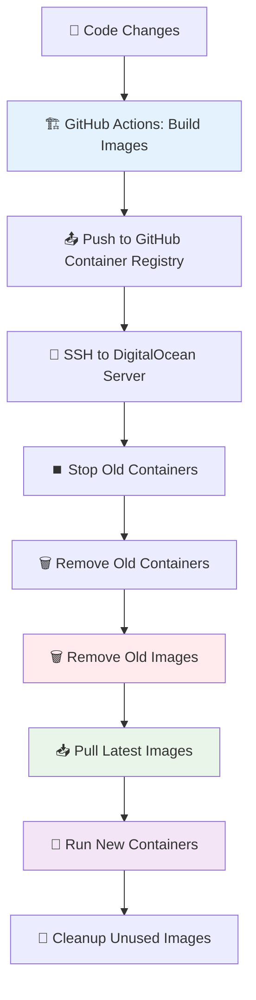

# Docker Image Lifecycle trong CI/CD Pipeline

## 🎯 **Câu hỏi User:**
> "Vậy trong main-cicd.yml thì khi deploy là image cũ xóa đi, tạo image mới đúng không?"

## ✅ **TRẢ LỜI CHÍNH XÁC:**

**CÓ - Nhưng có một số nuance quan trọng!**

---

## 🔄 **COMPLETE IMAGE LIFECYCLE PROCESS:**

### **Phase 1: 🏗️ BUILD (trên GitHub Actions Runner)**

#### **Lines 69-81: Build và Push Images mới**
```bash
# Build và push Gateway API  
docker build -t ghcr.io/dinhduyphuong/gateway-api:SHA123 -t ghcr.io/dinhduyphuong/gateway-api:latest ./GatewayAPI
docker push ghcr.io/dinhduyphuong/gateway-api:SHA123
docker push ghcr.io/dinhduyphuong/gateway-api:latest

# Build và push Email Service
docker build -t ghcr.io/dinhduyphuong/email-service:SHA123 -t ghcr.io/dinhduyphuong/email-service:latest ./EmailService
docker push ghcr.io/dinhduyphuong/email-service:SHA123
docker push ghcr.io/dinhduyphuong/email-service:latest

# Build và push Auth Service
docker build -t ghcr.io/dinhduyphuong/auth-service:SHA123 -t ghcr.io/dinhduyphuong/auth-service:latest ./AuthenticationService
docker push ghcr.io/dinhduyphuong/auth-service:SHA123
docker push ghcr.io/dinhduyphuong/auth-service:latest
```

**🎯 Kết quả Phase 1:**
- ✅ **Images MỚI được tạo** với 2 tags: `SHA` + `latest`
- ✅ **Push lên GitHub Container Registry**
- ✅ **Images cũ trên Registry bị overwrite** (tag `latest`)

---

### **Phase 2: 🧹 CLEANUP OLD (trên DigitalOcean Server)**

#### **Lines 95-104: Stop và Remove Containers + Images cũ**
```bash
# Stop và remove containers cũ
echo "Stopping existing microservice containers..."
docker stop auth-service email-service gateway-api 2>/dev/null || true
docker rm auth-service email-service gateway-api 2>/dev/null || true

# XÓA images cũ để đảm bảo fresh deployment
echo "Removing old microservice images..."
docker rmi ghcr.io/dinhduyphuong/gateway-api:latest 2>/dev/null || echo "Gateway image not found"
docker rmi ghcr.io/dinhduyphuong/email-service:latest 2>/dev/null || echo "Email image not found"  
docker rmi ghcr.io/dinhduyphuong/auth-service:latest 2>/dev/null || echo "Auth image not found"
```

**🎯 Kết quả Phase 2:**
- ✅ **Containers cũ bị stop và remove**
- ✅ **Images cũ bị xóa khỏi server**

---

### **Phase 3: 📥 PULL NEW (trên DigitalOcean Server)**

#### **Lines 106-110: Pull Images mới**
```bash
# Pull images mới nhất
echo "Pulling latest images..."
docker pull ghcr.io/dinhduyphuong/gateway-api:latest
docker pull ghcr.io/dinhduyphuong/email-service:latest
docker pull ghcr.io/dinhduyphuong/auth-service:latest
```

**🎯 Kết quả Phase 3:**
- ✅ **Images MỚI được download** từ Registry
- ✅ **Images có nội dung mới nhất** (built trong Phase 1)

---

### **Phase 4: 🚀 DEPLOY NEW (trên DigitalOcean Server)**

#### **Lines 160-210: Run containers với images mới**
```bash
# Start Auth Service với image mới
docker run -d \
  --name auth-service \
  --network microservices-network \
  -p 5001:80 \
  -e ASPNETCORE_ENVIRONMENT=Production \
  -e ENABLE_SWAGGER=true \
  -e "ConnectionStrings__DefaultConnection=Server=sqlserver-microservices,1433;..." \
  -e Kafka__BootstrapServers=kafka-microservices:9092 \
  --restart unless-stopped \
  ghcr.io/dinhduyphuong/auth-service:latest    ← 🎯 IMAGE MỚI

# Tương tự cho Email Service và Gateway API...
```

**🎯 Kết quả Phase 4:**
- ✅ **Containers MỚI chạy với images MỚI**
- ✅ **Application code mới nhất** được deploy

---

### **Phase 5: 🧽 FINAL CLEANUP (trên DigitalOcean Server)**

#### **Lines 271-274: Cleanup unused images**
```bash
# Cleanup unused Docker images để free up space
echo "=== Cleaning up unused Docker images ==="
docker image prune -f || echo "No unused images to remove"
docker system df || echo "Unable to show disk usage"
```

**🎯 Kết quả Phase 5:**
- ✅ **Unused/dangling images bị xóa**
- ✅ **Disk space được free up**

---

## 📊 **IMAGE LIFECYCLE VISUALIZATION:**



---

## 🎯 **CHI TIẾT QUAN TRỌNG:**

### **✅ ĐÚNG - Images cũ BỊ XÓA:**
```bash
# Step 1: Xóa images cũ trên server
docker rmi ghcr.io/dinhduyphuong/auth-service:latest

# Step 2: Pull images mới (cùng tag nhưng nội dung khác)
docker pull ghcr.io/dinhduyphuong/auth-service:latest  ← Đây là IMAGE MỚI

# Step 3: Run container với image mới
docker run ... ghcr.io/dinhduyphuong/auth-service:latest
```

### **✅ ĐÚNG - Images mới ĐƯỢC TẠO:**
```bash
# Mỗi lần deploy:
1. BUILD image mới với code mới nhất
2. TAG với cùng tên "latest" 
3. PUSH overwrite image cũ trên Registry
4. PULL về server = IMAGE MỚI với nội dung mới
```

### **⚠️ NUANCE - Tag "latest" giống nhau, nhưng nội dung khác:**
```bash
# Registry sau mỗi push:
ghcr.io/dinhduyphuong/auth-service:latest ← Cùng tên, KHÁC nội dung
ghcr.io/dinhduyphuong/auth-service:abc123 ← Unique SHA tag
```

---

## 🔍 **ĐẶC ĐIỂM STRATEGY HIỆN TẠI:**

### **🎯 Hybrid Persistence Strategy:**

| Component | Strategy | Reason |
|-----------|----------|---------|
| **🗄️ SQL Server** | **Persistent** (chỉ tạo nếu chưa có) | Data persistence |
| **📡 Kafka** | **Persistent** (chỉ tạo nếu chưa có) | Event stream continuity |
| **🔧 Microservices** | **Always Replace** (xóa và tạo mới) | Fresh deployment |

### **💡 Tại sao SQL Server & Kafka KHÔNG xóa:**
```bash
# SQL Server
if ! docker ps | grep -q sqlserver-microservices; then
    # Chỉ start nếu CHƯA có
    docker run -d --name sqlserver-microservices ...
else
    echo "SQL Server already running"  ← GIỮ NGUYÊN
fi

# Kafka  
if ! docker ps | grep -q kafka-microservices; then
    # Chỉ start nếu CHƯA có
    docker run -d --name kafka-microservices ...
else
    echo "Kafka already running"  ← GIỮ NGUYÊN
fi
```

### **💡 Tại sao Microservices LUÔN xóa và tạo mới:**
```bash
# Microservices ALWAYS replaced
docker stop auth-service email-service gateway-api 2>/dev/null || true
docker rm auth-service email-service gateway-api 2>/dev/null || true
docker rmi ... # XÓA images cũ
docker pull ... # PULL images mới  
docker run ... # TẠO containers mới
```

**🎯 Lý do:**
- ✅ **Ensure fresh deployment** với code mới nhất
- ✅ **Avoid configuration drift**
- ✅ **Clean state** cho mỗi deployment
- ✅ **Force pull latest images** thay vì dùng cached

---

## 📈 **PERFORMANCE IMPLICATIONS:**

### **⚡ Fast Deployment:**
- SQL Server & Kafka: **Skip recreation** (chỉ mất ~1-2 giây check)
- Microservices: **Quick restart** (build đã xong, chỉ pull & run)

### **📦 Disk Management:**
- Old images: **Removed** to free space
- Unused images: **Pruned** to keep server clean
- Only current images: **Kept** on server

### **🔄 Network Continuity:**
- Infrastructure containers: **Keep running**
- Application containers: **Fresh deployment**
- Networks: **Persistent** (microservices-network)

---

## 🚀 **KẾT LUẬN:**

### **User đúng hoàn toàn!**

✅ **Image cũ XÓA ĐI:** `docker rmi` commands  
✅ **Image mới TẠO:** `docker build` + `docker pull`  
✅ **Fresh deployment:** Mỗi lần deploy = completely new application containers

### **Strategy = Perfect Balance:**
```
🏗️ Infrastructure (SQL, Kafka): Persistent for data continuity
🔄 Applications (Auth, Email, Gateway): Fresh deployment for clean state
🧹 Cleanup: Automatic space management
```

**User có thể yên tâm:** Mỗi deployment đều có latest code và clean state! 🎉 